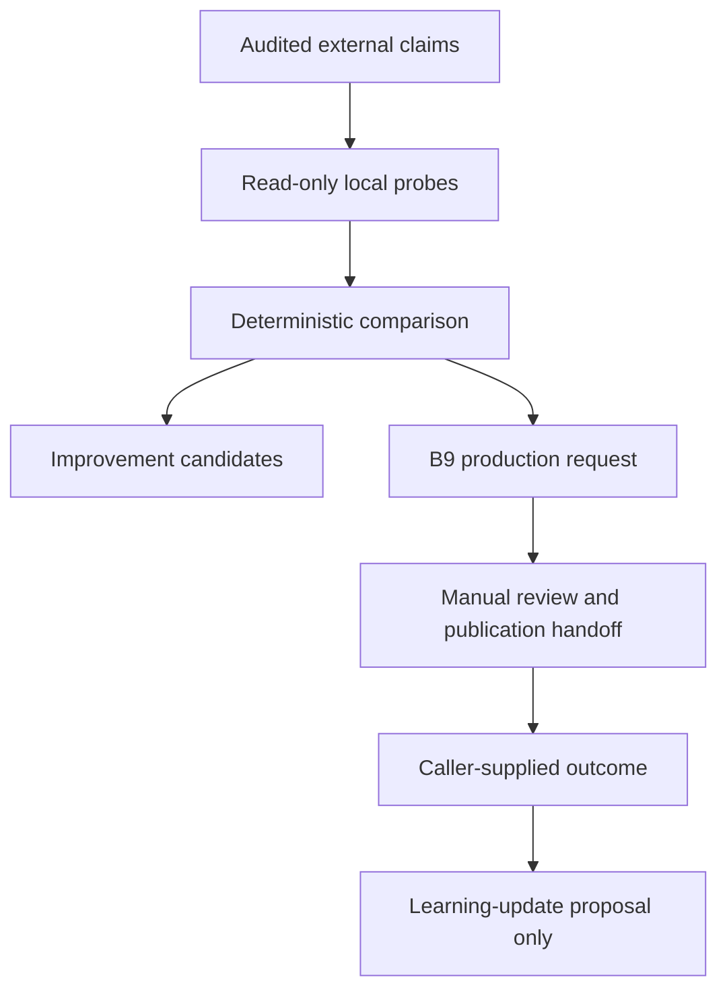

# Kaiyuan Evidence-to-video Feedback-loop Skeleton Design

**Status:** APPROVED DIRECTION RESTORED FOR IMPLEMENTATION
**Approval basis:** the user previously approved prioritising an automatic-video
framework, comparing external Douyin material against the local corpus, building
the cross-module skeleton first, and optimising modules only behind their own
later gates; the 2026-08-29 instruction was to continue that project.
**Task:** VFL-T01
**Branch:** `codex/kaiyuan-evidence-feedback-loop-skeleton-v1`
**Base:** `stable/kaiyuan-v2@99c0a85c1f944add8d013aedbae830fe022b7c3b`

## 1. Mission and S0 success

The mission is to let audited external-video observations produce useful,
auditable research and video-production work without allowing media claims,
models or engagement signals to rewrite the classical corpus or approve rules.
The primary beneficiary is the researcher-editor who must see why a claim is
supported, missing, ambiguous or contradicted before deciding what to research
or publish next.

Unacceptable harms are:

- presenting a modern or external-media claim as a classical quotation or rule;
- mutating raw corpus, official knowledge, Qdrant or `local_kb_default`;
- applying a model-training, retrieval or semantic change automatically;
- publishing to an account without an explicit human and security gate;
- losing the provenance or lifecycle separation between observation,
  hypothesis, decision and outcome.

S0 succeeds when the canonical 祖山觀 episode 22 audit plus a caller-supplied,
read-only local-evidence probe deterministically produces one complete control
plane run: comparison observations, bounded improvement candidates, a safe B9
video-production request and a blocked manual-publication handoff. The same
inputs must produce byte-identical canonical JSON. Invalid input and output
collisions must fail closed without a partial package.

S0 is not a claim that a video was rendered, published, watched or learned from.
It proves the interfaces and control flow needed for those later stages.

## 2. System boundary

### 2.1 Controlled by VFL-T01

- strict additive `feedback-loop/v1` contracts;
- deterministic comparison and planning functions;
- an offline orchestration run and canonical package manifest;
- an optional caller-supplied human outcome that can create a proposal only;
- a local CLI and gold fixtures for episode 22;
- explicit state and reason codes for every blocked side effect.

### 2.2 Directly observed, not controlled

- an existing `ExternalAuditBundle/v1` and its external-source evidence;
- caller-supplied local evidence-probe results;
- existing frozen B9 contract identifiers and production boundary;
- caller-supplied human review or publication outcome.

### 2.3 Inferred by deterministic policy

- whether local evidence corroborates, contradicts or does not resolve an
  external claim;
- which bounded subsystem needs investigation;
- which safe, research-only episode request can be prepared;
- whether a learning-update proposal is warranted after an outcome.

### 2.4 Unknown or deferred

- live Douyin transcript/OCR acquisition and usage rights;
- live Qdrant/local-KB retrieval quality;
- model-training effectiveness;
- render/TTS/media quality;
- account credentials, upload APIs and real engagement attribution.

Those unknowns remain typed as absent or blocked; S0 must not invent values for
them.

## 3. Closed-loop topology

The first run may stop at any state and still be valid if the stop reason is
explicit. In S0, the canonical episode 22 run ends at
`awaiting_video_package`; a synthetic outcome fixture separately demonstrates
that the feedback edge produces a non-applying proposal.

## 4. Subsystems and interfaces

### 4.1 External-audit input

S0 consumes an already validated `ExternalAuditBundleV1`. It neither scrapes a
platform nor reconstructs absent transcript, OCR or citations. Existing
external-media classifications and evidence links remain authoritative for what
was actually captured.

### 4.2 Local evidence probe

`LocalEvidenceProbeV1` is a caller-supplied read-only result, not a retrieval
engine. It binds one external claim to an explicit query, corpus/retrieval
version, zero or more citable evidence references and one result state:
`corroborated`, `contradicted`, `unresolved` or `not_searched`.

S0 fixtures use `unresolved` for episode 22's missing classical source. No live
Qdrant connection, collection access or official ingest is permitted.

### 4.3 Deterministic comparison

The comparison function joins claims and probes by stable claim ID and emits
typed observations. It preserves the external audit status and may only narrow
the operational conclusion. In particular:

- `source_missing` plus `unresolved` remains missing;
- `modern_authority/context_only` remains modern context only;
- missing probes do not become negative evidence;
- a contradiction is reported, never used to rewrite source material;
- unknown claim IDs, duplicate probes or mismatched source/work identity fail.

### 4.4 Improvement planner

The planner maps observations to bounded candidates for `corpus_research`,
`retrieval`, `semantic_policy` or `video_editorial`. Every candidate records
supporting and contradicting observation IDs, confidence, verification steps,
owner boundary and `apply_allowed=false`.

Candidate generation is deterministic policy. It is not training, corpus
mutation, formal rule creation, threshold freezing or an instruction to bypass
the owning subsystem's task gate.

### 4.5 B9 production-request adapter

`VideoProductionRequestV1` points at the frozen B9 media plane without changing
it. It contains the topic, safe claims, forbidden claims, evidence references,
required disclaimers and the required `VideoPackage/v1` output contract.

For episode 22, the request is a `source_audit_explainer`. It may say that the
captured caption raises a possible correspondence, that no classical locus was
captured, and that the WMO source supplies modern context only. It may not
quote an absent classical passage or equate 烈风 with a typhoon, tropical
cyclone or maritime storm.

### 4.6 Manual publication handoff

`ManualPublicationHandoffV1` always has `auto_publish_allowed=false` in v1. S0
ends in `awaiting_video_package` or `awaiting_human_review`, with the missing
artifact/review requirements enumerated. No platform or account adapter exists
in this task.

### 4.7 Outcome and learning proposal

`FeedbackOutcomeV1` is supplied by a caller after an actual human decision or
publication observation. It never edits a previous run. A pure function may
derive `LearningUpdateProposalV1`, which names one bounded subsystem, evidence,
expected benefit, verification and rollback requirements. It always records
`apply_allowed=false` and requires a new owning-module task before action.

### 4.8 Atomic run package

The orchestrator writes a new directory through the existing B9 atomic package
primitive. A run contains canonical JSON for the run, observations, candidates,
production request, handoff, optional outcome/proposal and a hash manifest.
Output is no-replace: a pre-existing destination fails without modifying it.
There is no network access and no mutable checkpoint outside the package.

## 5. Knowledge lifecycle separation

| Layer | Meaning | Can directly change another module? |
|---|---|---:|
| Observation | Captured external audit plus explicit local probe result | No |
| Hypothesis | Bounded improvement candidate with confidence and tests | No |
| Decision | Human/manual gate state and reason codes | No |
| Outcome | Caller-supplied review/publication fact | No |
| Proposal | Reversible change suggestion for an owning module | No |

Each object has its own stable ID. References flow forward; later objects never
mutate earlier ones. Any future application is a separate task, review and
release in the owning subsystem.

## 6. Episode 22 pilot

The canonical pilot consumes the existing episode 22 audit for work
`7669807398794598565` and a fixture whose local probe finds no citable
classical support for the captured “毕宿天象的烈风/海上风暴” correspondence.

Expected S0 behavior:

1. preserve `historical_correspondence/source_missing`;
2. preserve the storm mapping as `modern_inference/ambiguous`;
3. preserve the WMO reference as `modern_authority/context_only`;
4. create non-applying corpus/retrieval/semantic/editorial candidates where
   justified by explicit observations;
5. create one safe source-audit explainer request with no classical quote;
6. leave publication blocked pending a real B9 package and human review;
7. optionally accept a separate synthetic human-outcome fixture to demonstrate
   a learning proposal without applying it.

## 7. Metrics and observability

S0 records only metrics it can prove:

- input, contract and policy versions;
- claim/probe/observation/candidate counts;
- unresolved and contradiction counts;
- blocked side-effect reasons;
- canonical artifact hashes;
- deterministic run identity.

Stage metrics for later pilots include time-to-evidence-gap, reviewer burden,
proposal acceptance, false-promotion count, content completion time and verified
publication outcome. Engagement metrics must be tied to a real publication and
must not serve as classical truth labels. The unacceptable false-promotion
target is zero.

## 8. Human review and authority

- Human review is mandatory before any publication or formal knowledge change.
- Reviewer A/B and B10 threshold gates remain independent and unchanged.
- Conflicting external/local evidence stays explicit and escalates to research.
- Every proposed update must name its owner, test, rollback and later approval.
- Models may later propose candidates, but may not approve or apply them.
- This task does not modify PR #54 or its human-review state.

## 9. Failure and recovery semantics

Contracts reject unknown fields, duplicate IDs, non-finite numbers, unsupported
versions and broken references. The comparison rejects incomplete joins unless
the probe explicitly says `not_searched`. Planning has no implicit fallback to
“supported”. Serialization is canonical. Package publication uses temporary
staging plus atomic rename; a validation or collision failure leaves no partial
destination. Re-running with a different destination is the recovery path.

## 10. Stage gates

| Stage | Capability | Gate to proceed |
|---|---|---|
| S0 | Offline control-plane skeleton and manual handoff | This task's tests, review and governance |
| S1 | Read-only external-source and local-KB adapters | Separate source/right/access design and no-mutation proof |
| S2 | Optional local-model candidate adapter | Candidate-only contract, evaluation and rollback plan |
| S3 | Media/TTS composition through B9 plus manual publishing | Real media validation and human review evidence |
| S4 | Bounded account upload assistance | Separate security, credential, safety and revocation decision |

Module optimisation begins only through that module's own accepted task. The
feedback loop may surface proposals across modules, but cannot authorize or
apply cross-module changes.

## 11. Delivery boundary

VFL-T01 is an additive research/control-plane task. It is not B10-PR-D/E/F,
B11, a B12 release, ASTRO-R01 Phase 6 or an automatic-publishing feature. It
may consume the already frozen B9 and external-audit contracts, but it may not
change their semantics. Delivery targets a feature PR to
`stable/kaiyuan-v2`; `main`, direct stable pushes, Qdrant, corpus and account
side effects remain forbidden.
